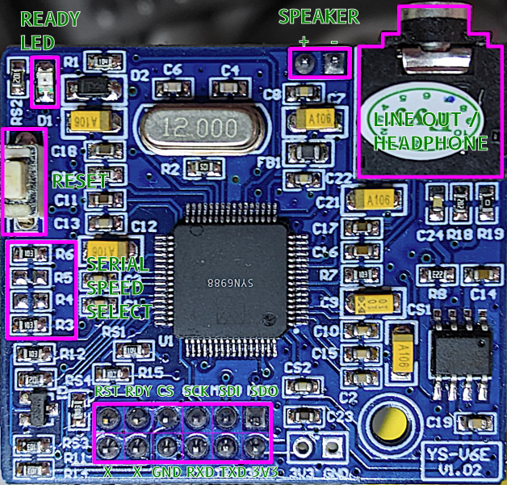
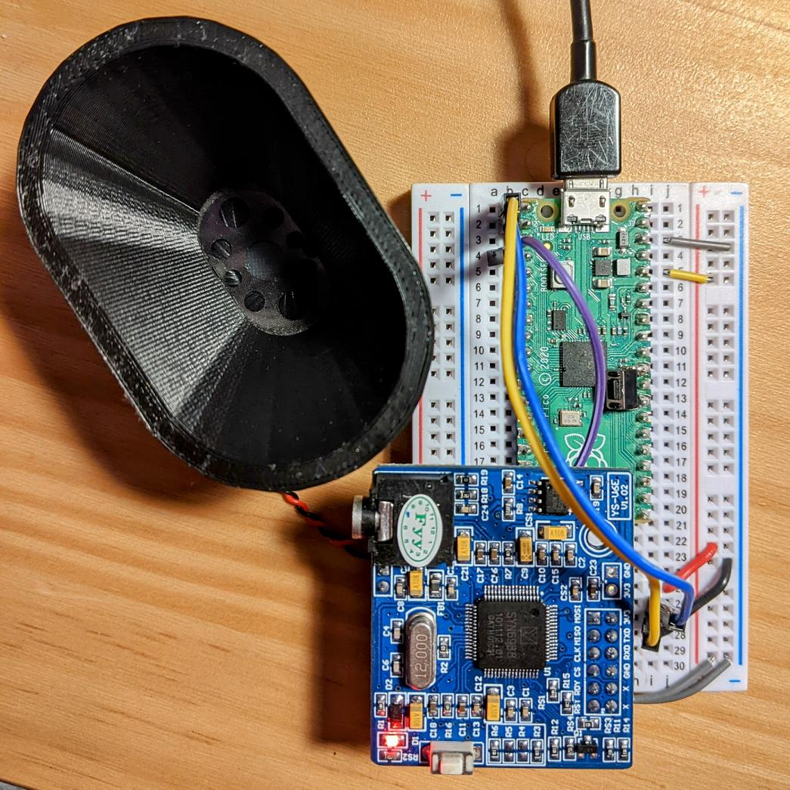

# micropython-SYN6988
MicroPython library for the YuTone VoiceTX SYN6988 text to speech module.

## Demo

<figure>
    <figcaption>SYN6988 MicroPython Demo:</figcaption>
    <audio
        controls
        src="images/syn6988-micropython-demo.mp3">
            <a href="images/syn6988-micropython-demo.mp3">
                Download audio
            </a>
    </audio>
</figure>
which comes from the following text:
```
[g2]Hello! [g1]你好![g2]
I can speak in English, and also in Chinese:
[g1]千里之行，始于足下。[g2]
which means: a journey of five hundred kilometres starts with the first step
[s1]I can speak slowly, [s9] and I can speak very fast[s5]
[v5]I can be [v10]loud or [v1]very quiet. [v5]
I can use [t1]low tones [t5]or [t8]high tones[t5]
[d][g0]my work here is done [x1]soundy[d]
```

## Introduction 



The SYN6988 is one of several speech synthesizer / text-to-speech
(TTS) modules available inexpensively on AliExpress and other
vendors. It's impressive because:

* it produces clear English speech without resorting to phonemes;

* it has a line out / headphone jack and small speaker outputs, both
  featuring very clean audio;
  
* it is easy to interface to, either through asynchronous serial or
  SPI (the latter not attempted here);
  
* it has some flexibility in volume, pitch and rate of speech (but
  it's no [DECtalk](https://github.com/dectalk/dectalk));
  
* it has a large library of alert tones built-in;
  
* it is not expensive, being around 🇨🇦 $15.

Of course, there are downsides:

* all of the documentation *so far* is in Chinese;

* it has only one faintly-accented female voice with a slightly robotic
  delivery;
  
* you may not get the board you ordered! I was sold this board as
  having an XFS5152 chip when it clearly has a SYN6988.
  
## Interfacing

The SYN6988 is a 3.3 V device for both logic and power. It requires a
two-wire UART connection plus an additional digital input pin to
monitor the busy status of the TTS.

        SYN6988        MicroPython Board     Raspberry Pi Pico
	   =========      ===================   ===================
	   
	        RDY            Digital Input         GPIO 2
		RXD            UART TXD              GPIO 0 (UART 0 TX)
		TXD            UART RXD              GPIO 1 (UART 0 RX)
		GND            Ground                Any GND pin
		3V3            3V3 supply            3V3(OUT)
		
The SYN6988 uses a fixed serial port rate defined by the arrangement
of resistors in the serial speed selection block. Mine is hard-wired
for 9600 baud.

For a Raspberry Pi Pico, these connections might be supported in code
with:

```python3
ser = machine.UART(0, baudrate=9600, bits=8, parity=None, stop=1)
busyPin = machine.Pin(2, machine.Pin.IN, machine.Pin.PULL_UP)

```

Audio output is either through the headphone / line out jack or via
the speaker pins. This output is unamplified. I can drive a very small
oval speaker at a comfortable volume from the speaker pins, but large
heaphones can be very quiet.

The board I have is not remotely breadboard-friendly. I solved that by
taking two 6-pin Arduino stacking headers, bending the pins out and
back in at right angles, then gluing the two headers back to
back. This gives a header block that bridges the central trough in a
breadboard, allowing the SYN6988 board to sit centrally.



## Operation

If the board is connected correctly, the red Ready LED will be lit
when the TTS is not speaking. This LED will go out when the TTS is
speaking, and the RDY pin will go low shortly (about 0.1 s) after the
speech starts, and go high when speech is finished.

If the initialization code above is used, the following MicroPython
will speak a rather quiet "Hello" from the board:

```python3
import syn6988

s = syn6988.SYN6988(ser, busyPin)
s.speak("[v1]hello")
```

There are very few methods and properties to this module:

* **speak**(*string*) - sends *string* to the TTS. Output can be
  shaped with embedded text commands. Accepts Unicode text including
  Traditional Chinese characters. Makes an extremely poor job of
  attempting non-English or non-Chinese language.
  
* **block** = *True* | *False* - by default, speech is emitted in
  *blocking mode*: that is, the `speak()` method will not return until
  the TTS has indicated it is finished. If `block = False` is set,
  `speak()` will return immediately, but the TTS will still be speaking
  and waiting is left up to the programmer.

* **isBusy**() - if called in non-blocking mode, `isBusy()` returns
  true while the TTS is speaking. This can be used to prevent
  interrupting speech. If called in blocking mode, will always return
  false.

## Embedded text commands

The SYN6988 is controlled by commands surrounded by `[]`. There are
many of these, and I don't understand them all. I've put a few of them
in `test-syn6988.py` with I hope clear meanings of what they do. In
brief:

* `[d]` - reset the TTS to standard mode. Can be useful after calling
  any of the alert sounds.
  
* `[g0]` - automatic language guessing; `[g1]` - Chinese language
  preference; `[g2]` - English language preference. English spoken in
  Chinese mode has strange intonation, while Chinese spoken in English
  mode may not be correctly detected.
  
* `[p*]` - pause, for example `[p500]` pauses for 500 ms.

* `[s*]` - speech rate: `[s0]` slowest to `[s10]` fastest.

* `[t*]` - tone/pitch: `[t0]` lowest to `[t10]` highest.

* `[x0]` / `[x1]` - interpret a string starting with "sound" as one
  of several hundred (?) different tones, chimes and alarms. For
  example `[x1]soundy[d]` plays a rather pleasing chime which I
  overuse greatly. It's important to use `[d]` after this command or
  unexpected results will occur.
  
* `[v*]` - volume: `[v0]` silent, `[v1]` quietest to `[v10]` loudest.


## Internals

The SYN6988 accepts a wide range of input encodings, none of which are
supported by MicroPython. It does, however, support UTF16-BE (two
bytes per char, no BOM, high byte first; eg: "hello" =>
`b'\x00h\x00e\x00l\x00l\x00o'`) which can be fairly easily fudged to
work. If our UTF-16BE encoded data is in `data_bytes` and we define

```python3
tx_len = len(data_bytes) + 2
```

the SYN6988 will accept the following byte stream over the serial port
and attempt to speak it:


    0xFD, tx_len // 256, tx_len % 256, 0x01, 0x04, data_bytes

The data string shouldn't be too long: something under 4096
characters, perhaps. The board can take up to 700 ms to process text,
and hence we pause for that long to make sure text is all spoken.

## References

* YuTone VoiceTX SYN6988 documentation (in Chinese only): [语音合成芯
  片-SYN6988中英文TTS语音芯
  片](http://www.voicetx.com/product/detail.html?id=11).

* My early attempts to drive this board from CPython: [Speech from
  Python with the SYN6988 module – We Saw a Chicken
  …](https://scruss.com/blog/2023/06/21/speech-from-python-with-the-syn6988-module/). This
  produces sound, but I'm actually driving it wrongly. Still works,
  though. Has an auto-translated copy of the programming reference,
  which is all I have had to work from.

* Richard Brautigan's poem *All Watched Over by Machines of Loving
  Grace*, "read" by a SYN6988 TTS chip driven by MicroPython: [All
  Watched Over By Machines of Loving Grace |
  SoundCloud](https://soundcloud.com/user8899915/all-watched-over-by-machines-of-loving-grace).
